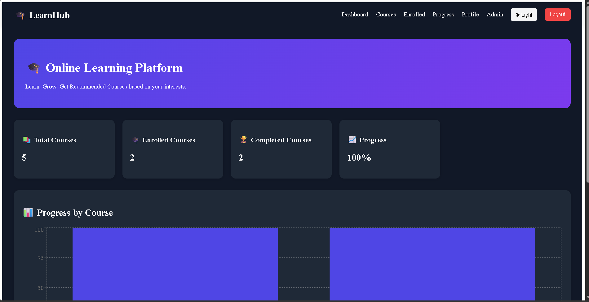
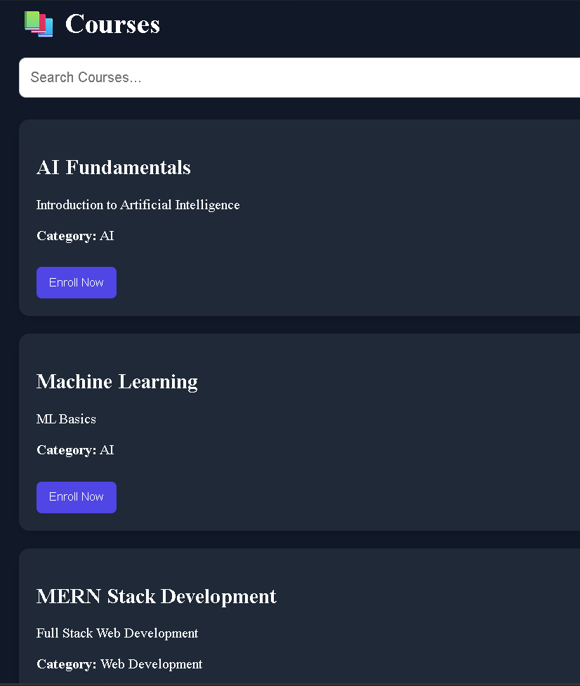
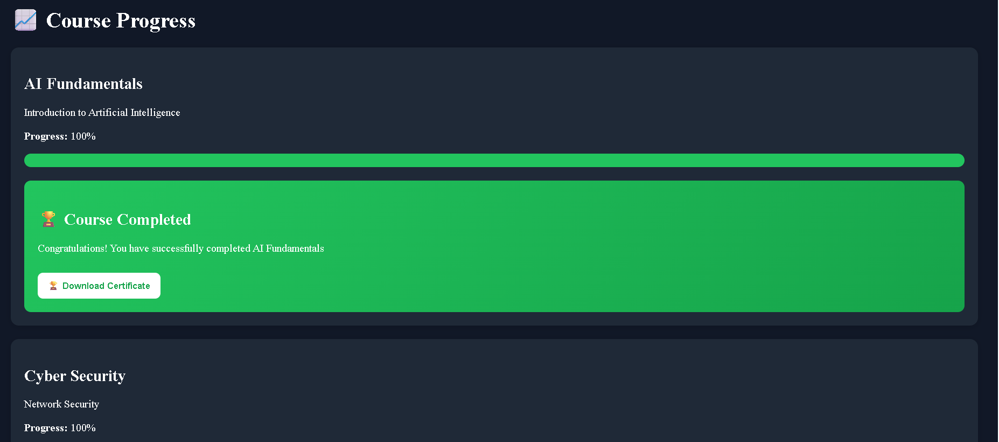
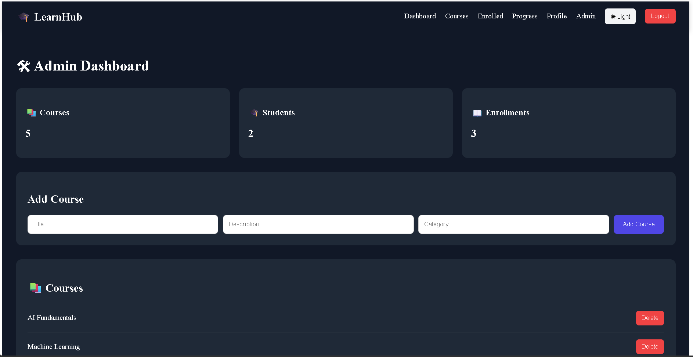

# 🎓 LearnHub – Online Learning Course Recommendation Platform

A Full Stack MERN Learning Management System (LMS) that allows students to enroll in courses, track learning progress, generate certificates, receive personalized course recommendations, and access a powerful admin dashboard.

---

## 🚀 Live Features

### 👨‍🎓 Student Features

- User Registration & Login
- Secure Authentication
- Browse Available Courses
- Search Courses
- Category-Based Course Filtering
- Course Enrollment
- Dynamic Lessons
- Mark Lessons as Completed
- Progress Tracking
- Course Completion Percentage
- PDF Certificate Generation
- Personalized Course Recommendations
- Dashboard Analytics
- User Profile Page
- Dark / Light Mode

---

### 🛠️ Admin Features

- Admin Dashboard
- Add New Courses
- Delete Courses
- View Students
- View Enrollments
- Platform Statistics
- Course Management System

---

### 📊 Analytics Features

- Total Courses
- Enrolled Courses
- Completed Courses
- Overall Progress
- Progress Bar Tracking
- Recharts Dashboard Visualization

---

## 🖼️ Project Screenshots

### Dashboard



### Courses



### Progress Tracking



### Admin Panel



---

# 🏗️ Tech Stack

## Frontend

- React.js
- Vite
- React Router DOM
- Axios
- Recharts
- jsPDF

## Backend

- Node.js
- Express.js

## Database

- MongoDB Atlas
- Mongoose

## Authentication

- JWT Authentication
- Local Storage Session Management

---

# 📂 Project Structure

```bash
online-learning-course-recommendation-platform
│
├── client
│   ├── src
│   │   ├── components
│   │   ├── pages
│   │   ├── services
│   │   └── App.jsx
│
├── server
│   ├── config
│   ├── controllers
│   ├── models
│   ├── routes
│   └── server.js
│
├── docs
│   └── screenshots
│
├── README.md
└── .env.example
```

---

# ✨ Implemented Modules

## Authentication Module

- Register User
- Login User
- Logout User

---

## Course Module

- View Courses
- Course Details
- Dynamic Lessons
- Category Filter
- Search Courses

---

## Enrollment Module

- Enroll Course
- View Enrolled Courses
- Unenroll Course

---

## Progress Module

- Lesson Completion Tracking
- Course Progress Calculation
- MongoDB Progress Storage
- Progress Dashboard

---

## Certificate Module

- Auto Certificate Generation
- PDF Download
- Completion Verification

---

## Recommendation Engine

Recommended courses based on:

- User Interests
- Enrolled Categories
- Learning Preferences

---

## Profile Module

Displays:

- Name
- Email
- Joined Date
- Enrolled Courses Count
- Completed Courses Count

---

## Admin Panel

Admin can:

### Manage Courses

- Add Course
- Delete Course

### Manage Users

- View Students
- View Enrollments

### Analytics

- Total Courses
- Total Students
- Total Enrollments

---

# 📊 Dashboard Analytics

The dashboard displays:

| Metric | Description |
|----------|------------|
| Total Courses | Available Courses |
| Enrolled Courses | User Enrollments |
| Completed Courses | Finished Courses |
| Progress | Average Learning Progress |

---

# 📈 Progress Chart

Implemented using:

```bash
npm install recharts
```

Displays course-wise progress:

```text
AI Fundamentals        100%
Machine Learning        67%
Cyber Security          33%
```

---

# ⚙️ Installation

## Clone Repository

```bash
git clone https://github.com/Vayu-143/online-learning-course-recommendation-platform.git
```

```bash
cd online-learning-course-recommendation-platform
```

---

# Backend Setup

```bash
cd server
npm install
```

Create `.env`

```env
PORT=5000

MONGO_URI=your_mongodb_connection_string

JWT_SECRET=your_secret_key
```

Run Server

```bash
npm run dev
```

---

# Frontend Setup

```bash
cd client
npm install
```

Run Client

```bash
npm run dev
```

---

# 🌐 API Routes

## Auth

```http
POST /api/auth/register
POST /api/auth/login
```

---

## Courses

```http
GET /api/courses
GET /api/courses/:id
POST /api/courses
DELETE /api/courses/:id
```

---

## Enrollments

```http
POST /api/enrollments
GET /api/enrollments/:userId
DELETE /api/enrollments/:userId/:courseId
```

---

## Progress

```http
PUT /api/enrollments/progress
GET /api/enrollments/progress/:userId
```

---

## Dashboard

```http
GET /api/dashboard/:userId
GET /api/dashboard/chart/:userId
```

---

## Profile

```http
GET /api/profile/:userId
```

---

## Recommendations

```http
GET /api/recommendations/:userId
```

---

## Admin

```http
GET /api/admin/stats
GET /api/admin/students
GET /api/admin/enrollments
POST /api/admin/course
DELETE /api/admin/course/:id
```

---

# 🔒 Environment Variables

Create:

```env
server/.env
```

Example:

```env
PORT=5000

MONGO_URI=your_mongodb_atlas_url

JWT_SECRET=your_secret_key
```

---

# 🎯 Future Improvements

- Course Video Uploads
- Quiz System
- Assignment Submission
- Role-Based Authentication
- Payment Gateway Integration
- Email Notifications
- Course Ratings & Reviews
- Admin Edit Course Feature
- Instructor Dashboard
- Live Classes
- Chat System

---

# 🧠 Learning Outcomes

This project demonstrates:

- MERN Stack Development
- REST API Design
- MongoDB Relationships
- Authentication Systems
- Dashboard Analytics
- PDF Generation
- Recommendation Systems
- CRUD Operations
- State Management
- Responsive UI Design

---

# 👨‍💻 Author

### Vayunandan Mishra

GitHub:

:[https://github.com/Vayu-143]

Project Repository:

[https://github.com/Vayu-143/online-learning-course-recommendation-platform]

---

# ⭐ Support

If you found this project useful:

⭐ Star the repository

🍴 Fork the repository

📢 Share with others

---

## 🏆 Full Stack MERN Learning Management System with Course Recommendations, Progress Tracking, Certificates, Dashboard Analytics, Profile Management, and Admin Panel.